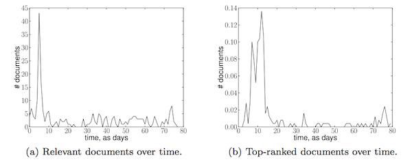

In this paper, we present an approach to query modeling that leverages the temporal distribution of documents in an initially retrieved set of documents. <!--more-->Query modeling is often used to better capture a user's information need and help bridge the lexical gap between a query and the documents to be retrieved. Typical approaches consider terms in some set of documents and select the most informative ones. These terms may then be reweighted and–in a language modeling setting–be used to estimate a query model, i.e., a distribution over terms for a query. Temporal distributions tend to exhibit bursts, especially in news-related document collections.

\[caption id="attachment_891" align="aligncenter" width="600"\] Time series for the query _grammys_.\[/caption\]

We define a burst to be a time period where unusually many documents were published; in our approach we detect bursts in result lists returned for a query. We then model the bursts using a reduced result list and select its most descriptive terms. Finally, we merge the term sets so as to arrive at a reformulation of the original query.

The main contributions we make in this paper are novel temporal query models and an analysis of their effectiveness, both for time-aware queries and for arbitrary queries. For query sets that consist of both temporal and non-temporal queries, our model is able to find the balance between performing query modeling or not: only if there are bursts and only if some of the top ranked documents are in the burst, the query is remodeled based on the bursts. We consistently improve over various baselines such as relevance models, often significantly so.

For query sets that consist of both temporal and non-temporal queries, our query modeling approach incorporates an effective selection method of terms. We consistently and significantly improve over various baselines, such as relevance models, on both news collections and a collection of blog posts.

See the Springer website for the online version, the PDF can be found below.

\[bibtex key=IRJ:2013:Peetz\]
